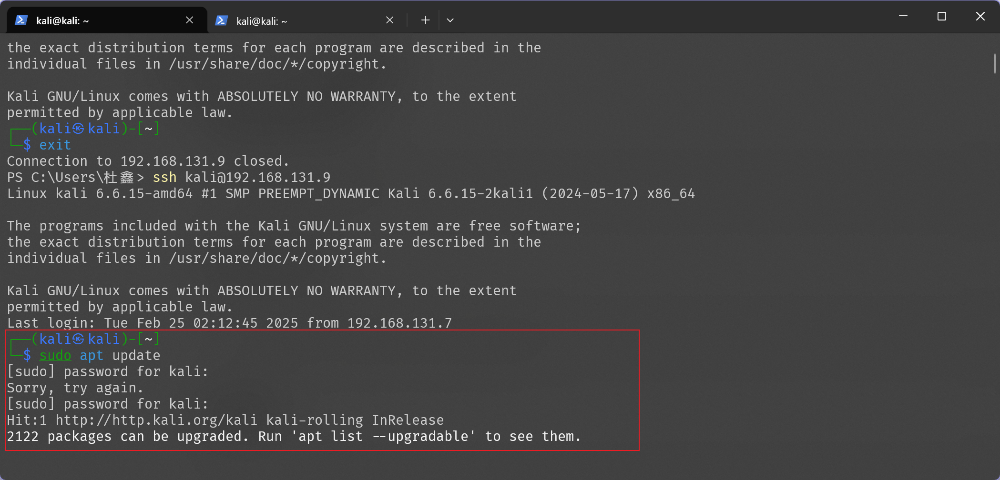
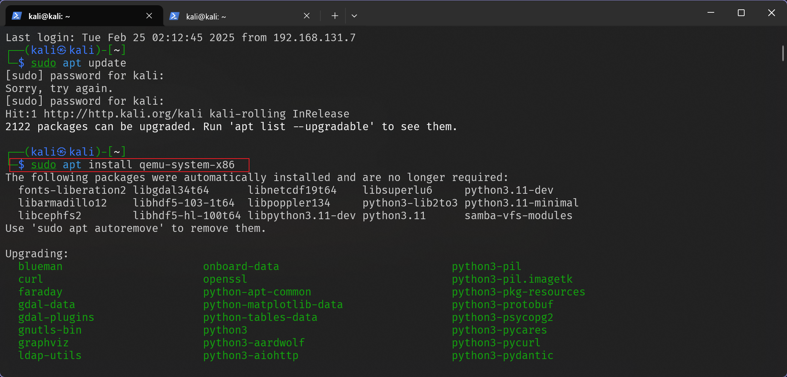
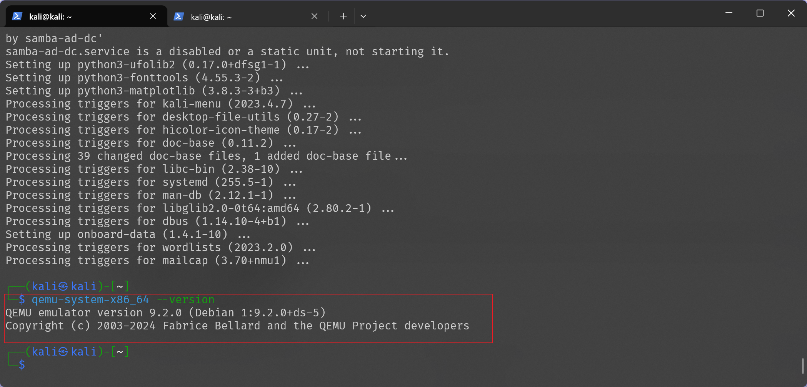
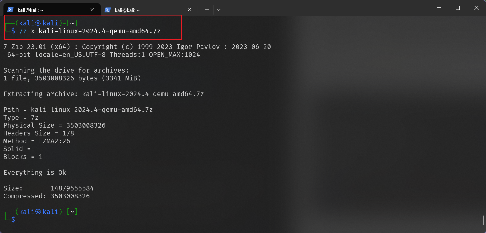
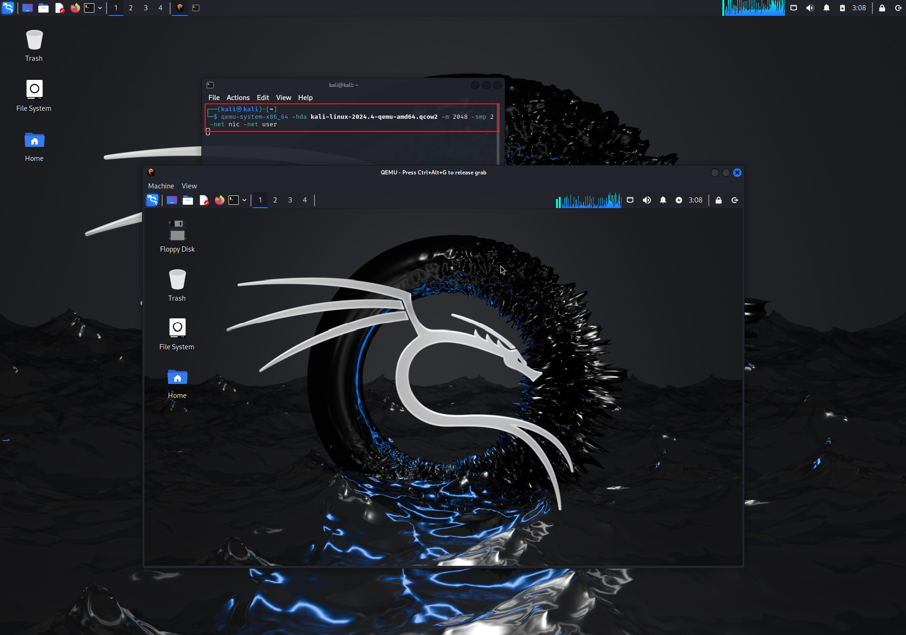
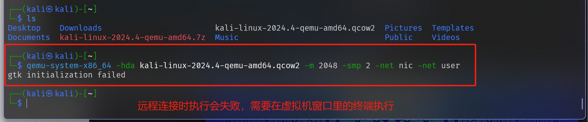

# Kali Linux QEMU虚拟化技术实验
---
## 实验目的
1. [x] 掌握QEMU虚拟化工具在Linux中的部署方法
2. [x] 学习使用QEMU创建和管理虚拟机
3. [x] 完成Linux系统在QEMU环境下的安装与配置
---
## 实验环境
- 主机系统:Kali Linux(VirtualBox)
- 硬件:
  - CPU:支持虚拟化技术(IntelVT-x/AMD-V)
  - 内存:16GB(windows主机为64GB)
  - 存储:>100GB可用空间
- 软件:
  - QEMU 7.2+
  - virt-manager(可选)
---
## 实验步骤
### 第一部分:QEMU环境搭建
#### 1. 在搭建好的`kali-linux`环境中,首先更新系统软件包列表


#### 2.然后安装QEMU组件，执行以下命令安装
```bash
sudo apt install qemu-system-x86
```



#### 3. 安装完成后，输入下面的命令查看版本号检验安装是否成功
```bash
qemu-system-x86_64 --version
```

若出现如下的结果，则证明`QEMU`组件安装成功



### 虚拟机创建

#### 1. 下载qemu磁盘文件

由于在`kali`虚拟机中下载缓慢，这里我是在`windows11`主机上下载完后传到了`kali`中，da直接访问下面的命令中的网页链接即可

```bash
wget https://cdimage.kali.org/kali-2024.4/kali-linux-2024.4-gemy-amd64.7z
```

[下载链接](https://cdimage.kali.org/kali-2024.4/kali-linux-2024.4-gemy-amd64.7z)

#### 2. 解压磁盘文件
将上面下载的文件传入虚拟机后，执行下面的命令解压即可
```bash
7z x kali-linux-2024.4-qemu-amd64.7z
```



#### 3.创建虚拟磁盘

根据解压后得到的磁盘文件，可以通过qemu启动虚拟机，执行下面的代码

```bash
qemu-system-x86_64 -hda kali-linux-2024.4-qemu-amd64.qcow2 -m 2048 -smp 2 -net nic -net user
```

正常执行后会开启一个虚拟机的窗口，效果如下图所示：



---
### 遇到的问题与解决方法
在启动qemu虚拟机的时候，出现了下面的问题，显示`gtk`初始化失败



将同样的代码放在linux虚拟机的窗口中的命令行中去执行便可正常运行，不会失败