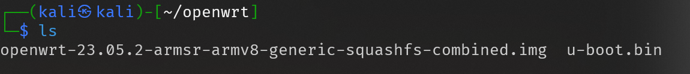
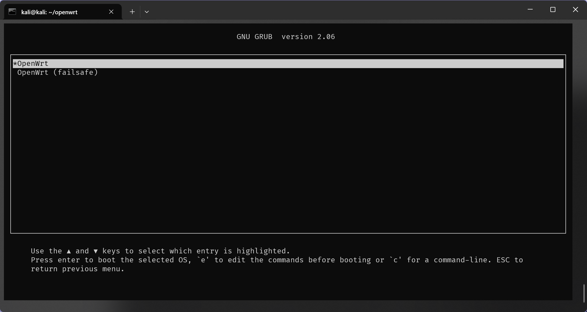
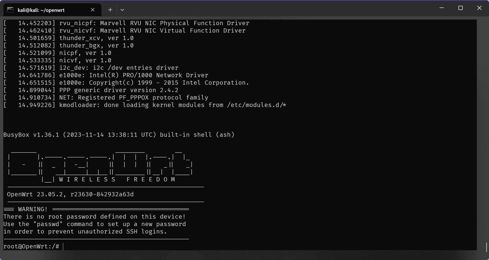
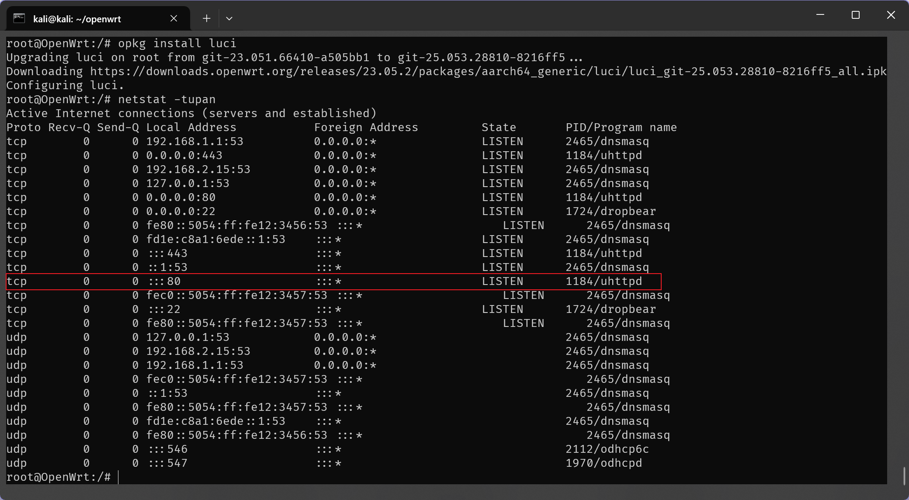
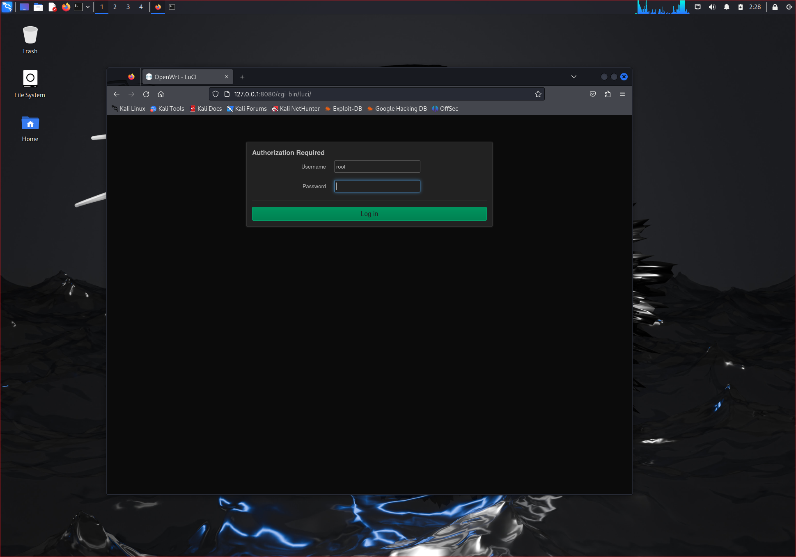
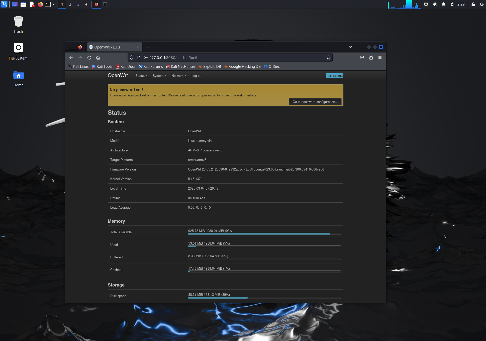
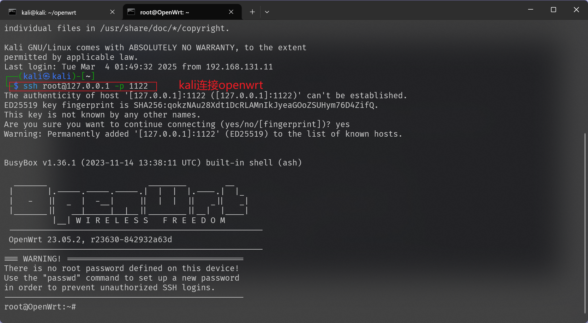
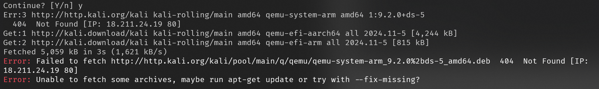

# 基于 QEMU 的 OpenWrt 仿真实验报告
---
## 1.实验目的
1. [x] 仿真 OpenWrt 系统:在 QEMU 虚拟环境中运行适用于 ARM 架构的 OpenWrt 镜像，验证系统能否正常启动并工作。
2. [x] 实现网页管理:通过 Web 浏览器访问 LuCl 管理界面，确保 Web 服务正常运行。
3. [x] 实现 ssh 连接:通过 ssh 连接到 OpenWrt 系统，验证 ssh 服务是否正常运行。
---
## 2.实验环境
- 硬件平台
  - 可选支持 QEMU 的主机(如 Apple M1 或基于 x86 64 的系统)

- 软件环境
  - QEMU(确保版本支持 ARM 虚拟化)
  - OpenWrt ARM 虚拟机镜像
  - SSH 客户端
  - Web 浏览器(Chrome、Firefox等)
---
## 3.实验步骤
### 3.1镜像下载与准备
首先创建一个目录用于存放镜像和引导文件，并进入此目录

```bash
mkdir openwrt
cd openwrt
```

然后下载所需的`OpenWrt`系统镜像和引导文件（这里使用了清华的镜像源去下载）

```bash
wget https://mirrors.tuna.tsinghua.edu.cn/openwrt/releases/23.05.2/targets/armsr/armv8/openwrt-23.05.2-armsr-armv8-generic-squashfs-combined.img.gz
wget https://mirrors.tuna.tsinghua.edu.cn/openwrt/releases/23.05.2/targets/armsr/armv8/u-boot-qemu_armv8/u-boot.bin
```

下载完毕后对镜像文件进行解压操作

```bash
gzip -d openwrt-23.05.2-armsr-armv8-generic-squashfs-combined.img.gz
```

操作完毕后目录结构如下：




### 3.2 QEMU 环境配置

在包含`u-boot.bin`和`openwrt-armsr-armv8`的文件夹内运行以下命令，启动模拟器并开始初始启动过程。

```bash
 qemu-system-aarch64 -cpu cortex-a72 -m 1024 -M virt,highmem=off -nographic \
-bios u-boot.bin \
-drive file=openwrt-23.05.2-armsr-armv8-generic-squashfs-combined.img,format=raw,if=virtio \
-device virtio-net,netdev=net0 -netdev user,id=net0,net=192.168.1.0/24,hostfwd=tcp:127.0.0.1:1122-192.168.1.1:22,hostfwd=tcp:127.0.0.1:8080-192.168.1.1:80 \
-device virtio-net,netdev=net1 -netdev user,id=net1,net=192.168.2.0/24
```

对这个命令的解释如下：
```
-cpu cortex-a72:指定模拟的CPU类型为ARM Cortex-A72
-m 1024:分配1024MB内存给虚拟机
-M virt,highmem=off: 使用 QEMU 的 virt 机器类型，并禁用高地址内存
-nographic:不使用图形界面，直接在终端中运行
-bios u-boot.bin: 指定 U-Boot作为引导程序
-drive file=...:指定 OpenWrt 系统镜像文件，使用 virtio 接口
网络配置:
    第一个网卡(net0):配置在 192.168.1.0/24 网段并设置端口转发SSH 端口: 
        本地1122转发到虚拟机的22端口
        Web端口:本地8080转发到虚拟机的 80 端口
    第二个网卡(net1):配置在 192.168.2.0/24 网段。
```

若缺少`qemu-system-aarch64`还需通过`apt`进行安装
正常运行效果如下：



继续敲击`[enter]`进入`openwrt`，便可得到下面的命令行界面：




### 3.3 启动网页界面

为了安装网页界面，需要使用`LuCi`软件包，更新软件包缓存,并安装该软件包

```bash
opkg update
opkg install luci
```

安装完毕后通过下面的命令查看网页运行情况

```bash
netstat -tupan
```



确定`uhttpd`已经在端口`80`运行后再`kali`的浏览器中访问`127.0.0.1:8080`进入网页端



登录后显示下面的内容（未设置密码）



### 3.4 ssh 连接

首先确保在`openwrt`中已经开启了`ssh`服务，使用下面的命令重启`Dropbear SSH`服务器：

```bash
/etc/init.d/dropbear restart
```

下面通过`kali`使用`ssh`连接`openwrt`

```bash
ssh root@127.0.0.1 -p 1122
```

连接成功后结果如下：



---
## 遇到的问题与解决方法

`qemu-system-aarch64`安装失败



在安装qemu-system-aarch64前先执行`apt update`更新软件包后再重复上面的安装命令即可正常安装