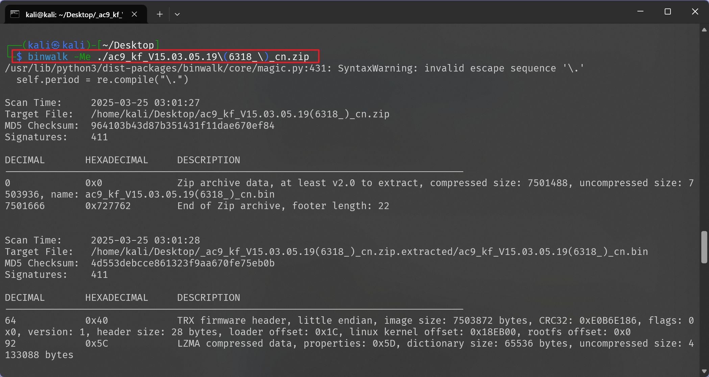
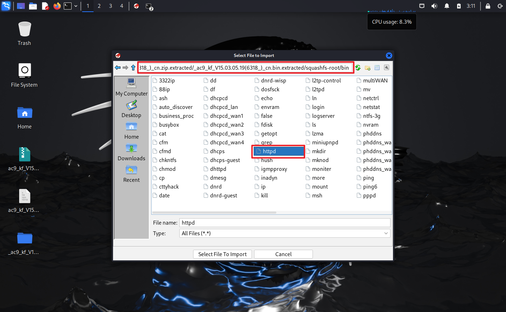
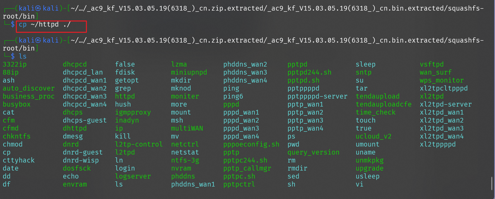

# 固件Patch与动态调试实验
---
## 1.实验目的
- [X] 掌握固件补丁(Patch)的基本⽅法和技术
---
## 2.实验环境
- 主机系统:Kali

- 硬件要求:
  - CPU:支持虚拟化技术
  - 内存:>4GB
  - 存储:≥10G空间
- 软件要求:
  - Ghidra
  - QEMU
  - Python 3.8+
  - GDB(可选)
---
## 3.实验步骤
### 第⼀部分：仿真原始 Tenda AC9固件
1. **Tenda AC9固件仿真问题背景**
这次实验使用的固件为官网提供的原始固件，通过这个固件学习怎么进行patch操作；
Tenda AC9固件(未被patch过的版本)在运⾏过程中会出现"假死"现象，主要原因是其在初始化过程中试图访问不存在的硬件导致⽆法仿真。所以我们需要通过patch来修改相关函数逻辑，跳过这些访问硬件的代码。

2. **获取并准备固件**

[在官⽹下载固件](https://www.tenda.com.cn/material/show/102682)

下载的是一个zip压缩包文件，可以通过使用binwalk提取其中的文件系统：
```bash
binwalk -Me ./ac9_kf_V15.03.05.19\(6318_\)_cn.zip 
```



然后直接使用上次实验的qemu组件即可

3. **尝试在⽤户态下仿真原始固件**

和之前一样，同样对 `/etc/network/interfaces` 进行配置：

```
auto lo 
iface lo inet loopback 
auto eth0 
iface eth0 inet dhcp 
auto br0 
iface br0 inet dhcp 
bridge_ports eth0 
bridge_maxwait 0 
```


同样对 `/etc/qemu-ifup` 也进行配置：

```
#! /bin/sh 
echo "Executing /etc/qemu/ifup" 
echo "Bringing up $1 bridged mode..." 
sudo /sbin/ifconfig $1 0.0.0.0 promisc up 
echo "Adding $1 to br0..." 
sudo /sbin/brctl addif br0 $1 
sleep 3
```


同样赋权并重启网络配置：

```bash
sudo chmod a+x /etc/qemu-ifup 
sudo systemctl restart systemd-networkd.service 
```


再次使用前一次实验安装的 `ifupdown` 并设置网口：

```bash
sudo apt install ifupdown 
sudo ifdown br0 && sudo ifup br0 
```


对提取的文件的目录进行赋权，方便后面使用，然后将对应的 qemu ⽤户态静态启动程序拷⻉到当前路径，以便在 chroot 环境下使⽤
 


同样进行修复和赋权：

```bash
cp -r webroot_ro/* webroot/
ls -l bin/httpd 
chmod +x bin/httpd 
```


启动仿真：
```bash
sudo qemu-arm -L ./ bin/httpd 
```


结果出现报错，没有开启端口，web 当然也无法访问

---
### 第⼆部分：对原始的⼆进制⽂件进⾏patch

1. **安装并使⽤Ghidra来patch固件（此实验⼿册仅介绍ghidra的patch⽅法，使⽤IDA pro的原理⼀致）**


首先安装并启动 `ghidra ` 

```bash
sudo apt install ghidra 
ghidra
```


在 `ghidra` 建立一个新的项目：


将之前提取的文件系统中 `httpd` 导入，`httpd` 的位置和上次实验的相对位置一样：




开始进行分析：


go to 导航到指定位置：


对有问题的地方进行编辑修改(`ctrl+shift+G`):

```
mov r3, 1 即 01 30 a0 e3
```


修改完成后将修改过的文件导出为 `original file`:


然后替换原来位置的 `httpd` 文件：



重新启动仿真：

```bash
sudo qemu-arm -L ./ bin/httpd 
```


然后根据输出的端口和 ip ，去 web 中也能够成功访问:


---

### 第三部分：逆向分析patch固件⼆进制程序的原理以及原因

1. **修改前的汇编代码：**


通过又侧反编译的内容可以看出当变量 `ivar4` 为 0 就会显示连接失败，进而导致启动失败

2. **修改前的汇编代码：**

所以，将 `ivar4`变量的值直接赋值为 1 就可以绕过连接检测比较（不会被再次赋值），直接启动


---
## 遇到的问题与解决方法

- 直接使用 `unzip` 解压官方的压缩文件得到的是一个 bin 文件，无法提取系统文件，还是要使用 `binwalk` 再次提取，所以不如直接使用 `binwalk` 进行提取压缩包，直接就能够得到系统文件

- `httpd` 文件修改导出后直接替换了原来的，没有进行备份，无法分析原始版本；通过重新提取官方原始系统文件得到旧的 `httpd` 解决
